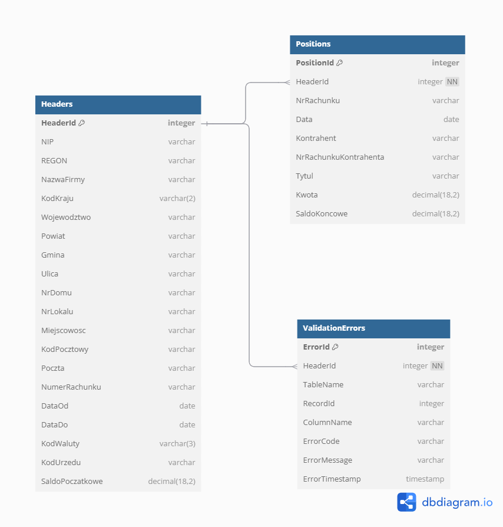
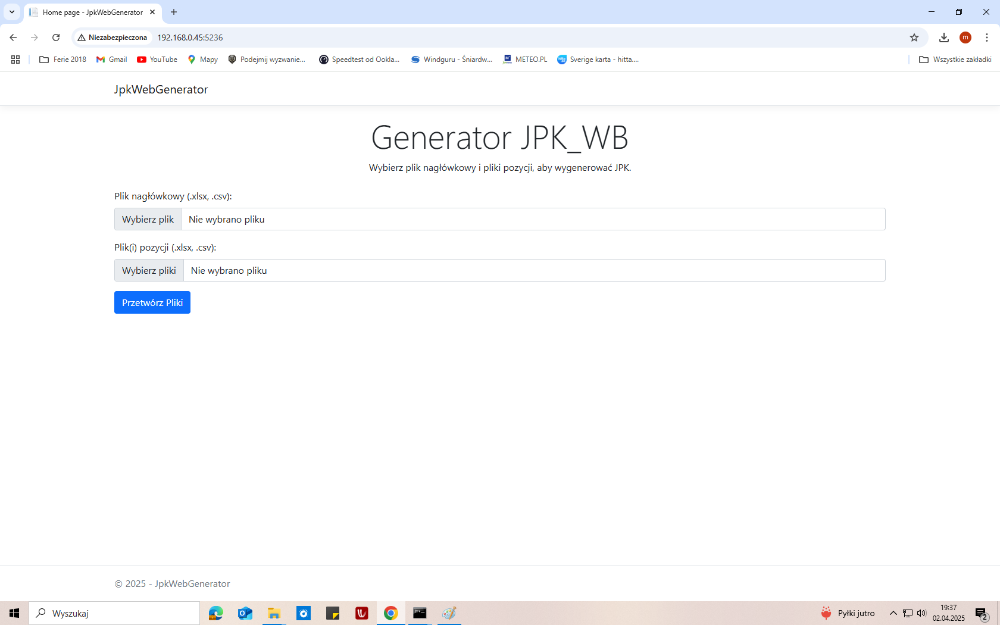
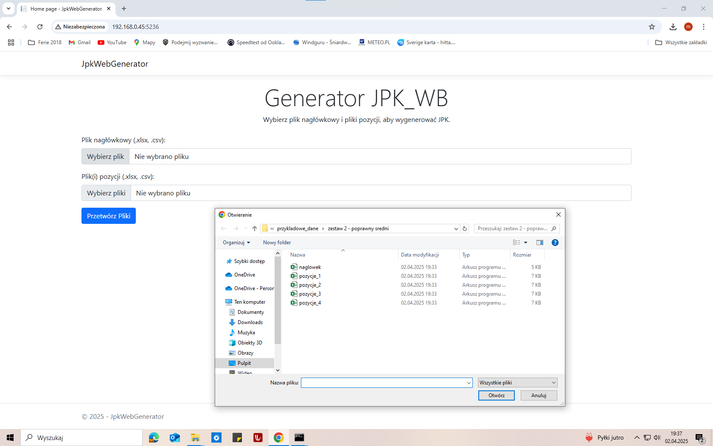
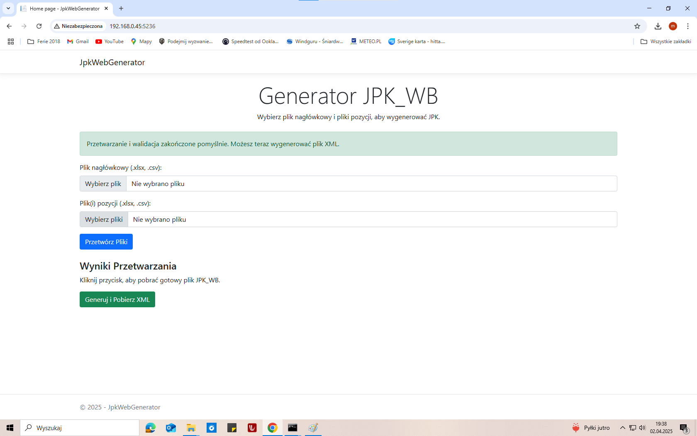
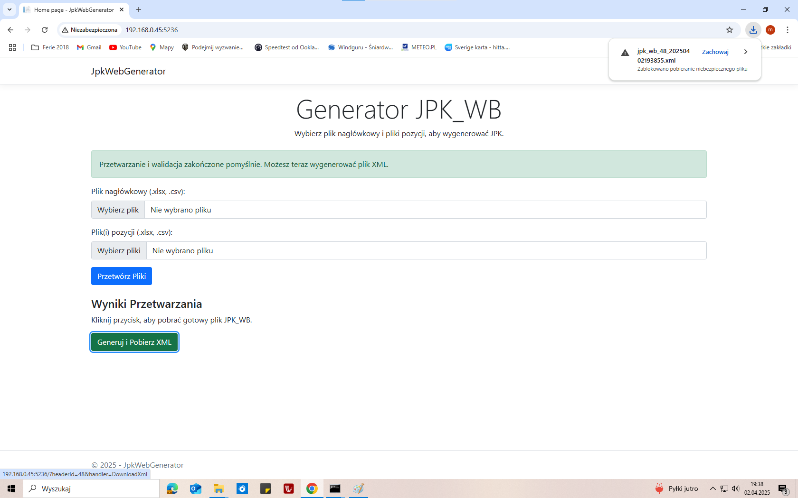
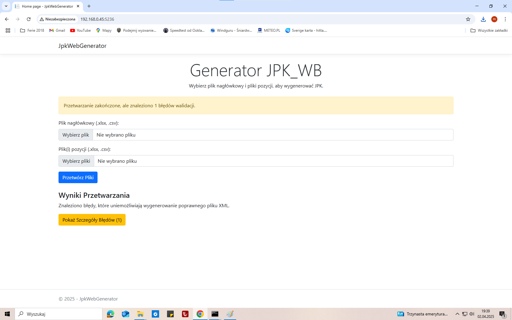
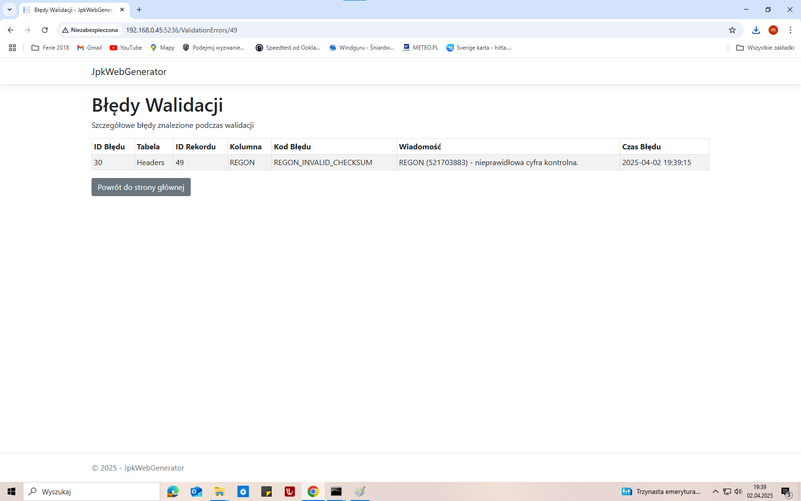

# Webowy Generator plików XML zgodnych z JPK_WB - Jakub Klenkiewicz

# 1. Wprowadzenie i Cel Projektu

## **1.1. Kontekst Biznesowy/Regulacyjny**

Zgodnie z polskimi przepisami podatkowymi, przedsiębiorcy są zobowiązani do raportowania danych w formie Jednolitego Pliku Kontrolnego (JPK). Jedną z wymaganych struktur jest JPK_WB (Wyciąg Bankowy), która ustandaryzowała sposób przekazywania informacji o operacjach na rachunkach bankowych. Struktura ta jest zdefiniowana za pomocą schematu XSD publikowanego przez Ministerstwo Finansów/Krajową Administrację Skarbową.

## **1.2. Problem**

Ręczne przygotowanie plików JPK_WB lub adaptacja danych z systemów bankowych, które często eksportują dane w formatach generycznych (jak XLSX czy CSV), jest czasochłonne i podatne na błędy. Proponuję narzędzię webowe, które automatyzowałoby ten proces, zapewniając jednocześnie walidację danych i zgodność z obowiązującym schematem.

## **1.3. Cel Projektu**

Głównym celem projektu było zaprojektowanie i implementacja aplikacji webowej w technologii [ASP.NET](http://asp.net/) Core 7.0 z wykorzystaniem bazy danych Microsoft SQL Server. Aplikacja miała na celu umożliwienie użytkownikom łatwego i szybkiego generowania poprawnych plików JPK_WB w formacie XML na podstawie danych źródłowych dostarczonych w plikach XLSX lub CSV. Kluczowe założenia obejmowały:

- Import danych nagłówkowych i transakcyjnych (pozycji) z plików.
- Walidację zaimportowanych danych pod kątem logiki biznesowej i wymagań JPK.
- Generowanie pliku XML zgodnego ze schematem JPK_WB.
- Walidację wygenerowanego XML względem oficjalnego schematu XSD.
- Zapewnienie możliwości jednoczesnej pracy wielu użytkowników.

## **1.4. Zakres Projektu**

Aplikacja obejmuje pełen cykl przetwarzania danych: od momentu przesłania plików przez użytkownika (`Index.cshtml`), przez ich tymczasowe zapisanie, sparsowanie (`FileReader.cs`), zapisanie do bazy danych (`DatabaseWriter.cs`), wykonanie logiki walidacyjno-generującej w SQL Server (procedury  `GenerateJPK_WB_XML` , `ValidateImportData`) , aż po walidację XSD w C# i udostępnienie finalnego pliku XML lub listy błędów (`ValidationErrors.cshtml`).

# 2. Opis Funkcjonalny Aplikacji

## **2.1. Główne Funkcjonalności**

### **Import Danych**

Interfejs użytkownika (`Pages/Index.cshtml`) pozwala na wgranie:

- Jednego pliku nagłówkowego (format .xlsx lub .csv), zawierającego dane identyfikujące podmiot, rachunek bankowy, okres sprawozdawczy i walutę.
- Jednego lub wielu plików pozycji (format .xlsx lub .csv), zawierających szczegóły transakcji bankowych oraz informację o saldzie początkowym (identyfikowaną jako wiersz z pustą wartością w kolumnie `KwotaOperacji` lub jej brakiem).

### **Przetwarzanie Danych:**

- Pliki po przesłaniu są tymczasowo zapisywane na serwerze w katalogu `wwwroot/temp_uploads` z unikalną nazwą (GUID).
- Dane są odczytywane i parsowane przy użyciu bibliotek EPPlus (dla .xlsx) i CsvHelper (dla .csv) w klasie `FileReader`.
- Logika identyfikuje wiersz salda początkowego i mapuje dane na obiekty `HeaderData` i `List<PositionData>`.

### **Walidacja Danych i Generowanie XML:**

- Dane nagłówkowe i pozycje są zapisywane do tabel `Header` i `Position` w bazie SQL Server za pomocą dedykowanych metod w `DatabaseWriter`. Każdy nagłówek otrzymuje unikalne `HeaderID`, które jest następnie przypisywane do powiązanych pozycji.
- Główna logika walidacyjno-generująca jest hermetyzowana w procedurach na Serwerze SQL. Procedura ta jest wywoływana z C# (`DatabaseWriter.cs`) po zapisaniu wszystkich danych dla danego `HeaderID`.
- Procedury te odpowiadają za:
    - Sprawdzenie spójności danych (np. kontrola bilansowania salda, poprawność dat, formaty pól itd.).
    - Wygenerowanie struktury XML pliku JPK_WB na podstawie danych z tabel `Header` i `Position` dla przekazanego `HeaderID`.
    - Zwrócenie wyniku: albo wygenerowanego XML, albo listy błędów walidacyjnych.

### **Walidacja XSD**

Otrzymany z bazy danych ciąg XML jest następnie walidowany w logice aplikacji C# (`Index.cshtml.cs`) względem pliku schematu `JPK_WB(1)_v1-0.xsd` przy użyciu klas `XmlReader` i `XmlSchemaSet`.

### **Obsługa Błędów**

- Błędy zwrócone przez procedurę SQL są mapowane na listę obiektów `ValidationError`.
- Błędy wykryte podczas walidacji XSD w C# są również dodawane do tej listy.
- W przypadku wykrycia błędów, użytkownik jest o tym informowany z możliwością przejścia na stronę `ValidationErrors.cshtml`, gdzie wyświetlana jest szczegółowa lista problemów.

### **Obsługa Współbieżności**

Każdy proces przetwarzania (sesja wgrania plików przez użytkownika) operuje na unikalnym `HeaderID`. Wszystkie operacje bazodanowe (zapis, walidacja, generowanie XML) filtrują dane po tym identyfikatorze (`WHERE HeaderID = @HeaderID`), co zapewnia izolację danych pomiędzy równocześnie pracującymi użytkownikami, pomimo korzystania z tych samych tabel na serwerze SQL.

### **Czyszczenie Danych**

Tymczasowe pliki na serwerze są usuwane po zakończeniu przetwarzania (w bloku `finally` w `Index.cshtml.cs`). Dane w tabelach SQL pozostają, ale są rozdzielone przez `HeaderID`.

## **2.2. Przepływ Pracy Użytkownika**

1. Użytkownik otwiera stronę główną aplikacji (`/Index`).
2. Za pomocą formularza wybiera plik nagłówkowy oraz jeden lub więcej plików pozycji.
3. Kliknięcie przycisku "Przetwórz Pliki" inicjuje proces po stronie serwera.
4. Aplikacja przetwarza pliki, zapisuje dane do SQL Server, wywołuje procedury
5. Jeśli procedury SQL zwrócą błędy lub walidacja XSD w C# nie powiodła się, użytkownik widzi stronę z listą błędów (`/ValidationErrors`).
6. Jeśli proces zakończył się sukcesem, użytkownikowi oferowany jest do pobrania wygenerowany plik `jpk_wb.xml`.

# 3. Architektura Techniczna

## **3.1. Przegląd Architektury**

Aplikacja została zbudowana w oparciu o wzorzec Model-View-Controller (specyficznie przy użyciu Razor Pages w [ASP.NET](http://asp.net/) Core), z wyraźnym podziałem na warstwy prezentacji, logiki biznesowej i dostępu do danych.

## **3.2. Warstwa Prezentacji (Frontend)**

- Technologia: [**ASP.NET](http://asp.net/) Core 7.0 Razor Pages**.
- Struktura: Główne strony to `Index.cshtml` (formularz uploadu, logika inicjująca), `ValidationErrors.cshtml` (wyświetlanie błędów), `Error.cshtml` (ogólna obsługa błędów). Wykorzystano standardowy layout (`_Layout.cshtml`) i biblioteki klienckie (Bootstrap, jQuery).
- Odpowiedzialność: Renderowanie interfejsu, przyjmowanie danych od użytkownika (pliki), wyświetlanie wyników i błędów.

## **3.3. Warstwa Logiki Biznesowej (Backend)**

- Technologia: **C# 11 na platformie .NET 7.0**.
- Struktura:
    - Modele stron Razor (`Index.cshtml.cs`, `ValidationErrors.cshtml.cs`): Zawierają logikę obsługi żądań HTTP (`OnPostAsync`), orkiestrację procesu (wywołanie serwisu plików i bazy danych), zarządzanie stanem (np. przechowywanie listy błędów).
    - Serwisy (`Services/`): (*Pierwotnie napisane dla lokalnej, konsolowej wersji generatora JPK_WB*)
        - `FileReader.cs`: Odpowiedzialny za odczyt i parsowanie plików XLSX (przy użyciu biblioteki **EPPlus**) i CSV (przy użyciu biblioteki **CsvHelper**). Zawiera podstawową logikę mapowania danych na obiekty `HeaderData` i `PositionData`.
        - `DatabaseWriter.cs`: Odpowiedzialny za całą komunikację z bazą danych SQL Server. Używa Ado.net (`SqlConnection`, `SqlCommand`, `SqlParameter`) do wykonywania zapytań INSERT (`SaveHeader`, `SavePosition`) oraz wywoływania procedur składowanych. Zarządza połączeniem bazodanowym (connection string z `appsettings.json`).
    - Modele danych (`HeaderData.cs`, `PositionData.cs`, `ValidationError.cs`): Proste klasy reprezentujące struktury danych.
- Odpowiedzialność: Implementacja logiki biznesowej, walidacja XSD (`Index.cshtml.cs`), obsługa plików, komunikacja z bazą danych, zarządzanie błędami, logowanie (`ILogger`).

## **3.4. Warstwa Danych (Baza Danych)**

- System: **Microsoft SQL Server** **2022**
- Struktura
    - Tabele opisane w punkcie 5 (Struktura Bazy Danych)
- Logika w Bazie Danych:
    - Procedura składowana `SaveHeader`: Przyjmuje parametry odpowiadające polom `HeaderData`, zapisuje rekord do tabeli `Header` i zwraca wygenerowane `HeaderID`.
    - Procedura składowana `SavePosition`: Przyjmuje parametry odpowiadające polom `PositionData` (w tym `HeaderID`), zapisuje rekord do tabeli `Position`.
    - **`usp_ValidateImportData`:** Ta procedura wykonuje **kompleksową walidację** danych dla wskazanego `HeaderId`.
    - **`usp_GenerateJPK_WB_XML`:** Procedura ta odpowiada za **wygenerowanie finalnego dokumentu XML** w formacie JPK_WB.
- **3.5. Środowisko:**
    - Serwer aplikacyjny: Windows 10 (domowa stacja robocza)
    - System Operacyjny Serwera: Windows 10 (domowa stacja robocza)
    - Środowisko deweloperskie: Visual Studio 2022.

# 4. Implementacja Kluczowych Mechanizmów

## **4.1. Wczytywanie i Parsowanie Plików Wejściowych:**

- Obsługa uploadu plików jest realizowana przez standardowe mechanizmy [asp.net](http://asp.net) Core Razor Pages (`IFormFile`).
- Pliki są zapisywane tymczasowo w `wwwroot/temp_uploads` z unikalną nazwą generowaną przez `Guid.NewGuid()`
- Serwis `FileReader` (`ReadHeaderData`, `ReadPositionData`) wykorzystuje:
    - **EPPlus:** Do otwierania i czytania danych z plików `.xlsx`.
    - **CsvHelper:** Do czytania danych z plików `.csv`, z konfiguracją separatora (domyślnie ';') i mapowaniem kolumn na właściwości modeli `HeaderData` i `PositionData` na podstawie nazw nagłówków w pliku CSV (ignorując wielkość liter).
    
    
    
- Logika `FileReader` identyfikuje wiersz salda początkowego w pliku pozycji poprzez sprawdzenie, czy pole `KwotaOperacji` jest `null` lub puste.
- Strumienie plików są poprawnie zamykane (`using` statement).
- Tymczasowe pliki są usuwane w bloku `finally` metody `OnPostAsync` w `Index.cshtml.cs` za pomocą `System.IO.File.Delete`.

## **4.2. Interakcja z Bazą Danych (DatabaseWriter.cs):**

Serwis `DatabaseWriter` zarządza komunikacją z bazą MS SQL Server. Połączenie jest nawiązywane przy użyciu `SqlConnection`, a connection string pobierany jest z konfiguracji aplikacji (`_configuration.GetConnectionString("DefaultConnection")`). 

- **Sprawdzenie Struktury Bazy:** Metoda `EnsureTablesExistAsync` przy starcie lub przed operacjami weryfikuje istnienie tabel `Headers`, `Positions`, `ValidationErrors` i tworzy je lub modyfikuje (dodaje brakujące kolumny jak `HeaderId` w `ValidationErrors`), jeśli jest to konieczne.
- **Zapis Danych:**  Dane nagłówkowe (`HeaderData`) zapisywane są do tabeli `dbo.Headers` za pomocą bezpośredniego polecenia `INSERT INTO ...` w metodzie `InsertHeaderDataAsync`. Identyfikator nowo utworzonego rekordu (`HeaderId`) jest pobierany przy użyciu `SELECT SCOPE_IDENTITY()` i zwracany do logiki aplikacji (`Index.cshtml.cs`).
- Dane pozycji (`PositionData`), po przefiltrowaniu wiersza salda początkowego i przypisaniu im uzyskanego `HeaderId`, są wstawiane masowo do tabeli `dbo.Positions` za pomocą klasy `SqlBulkCopy` w metodzie `InsertPositionDataBulkAsync`. Mapowanie kolumn z `DataTable` na kolumny tabeli docelowej jest jawnie zdefiniowane.
- **Wywołanie Logiki SQL:** Metoda `ValidateImportAsync` wywołuje procedurę składowaną `dbo.usp_ValidateImportData`, przekazując `HeaderId`. Procedura ta wykonuje walidację w SQL i zwraca liczbę znalezionych błędów jako wynik `ExecuteScalarAsync`. * Metoda `GetValidationErrorsAsync` pobiera szczegóły błędów dla danego `HeaderId` z tabeli `dbo.ValidationErrors` za pomocą zapytania `SELECT`.
- Metoda `GenerateXmlAsync` **najpierw ponownie wywołuje `ValidateImportAsync`**, aby upewnić się, że dane są poprawne. Jeśli walidacja zwróci 0 błędów, metoda wywołuje procedurę składowaną `dbo.usp_GenerateJPK_WB_XML` (przekazując `HeaderId`) za pomocą `ExecuteScalarAsync`, oczekując zwrócenia gotowego XML jako ciągu znaków. Jeśli walidacja wewnętrzna się nie powiedzie, metoda zwraca `null`.

## **4.3. Logika Walidacyjna:**

- **Walidacja w SQL:** Jest realizowana przez dedykowaną procedurę składowaną `dbo.usp_ValidateImportData`, wywoływaną jawnie z kodu C# (`DatabaseWriter.ValidateImportAsync`) po zapisaniu danych do bazy. Procedura ta przeprowadza szczegółową weryfikację danych nagłówka i pozycji, sprawdzając kompletność, poprawność formatów (NIP, REGON, IBAN, daty, kody), sumy kontrolne oraz kluczową **kontrolę ciągłości salda**. Wykryte błędy są zapisywane w tabeli `dbo.ValidationErrors`. Wynikiem działania procedury jest liczba wykrytych błędów.
- **Walidacja XSD w C# (`Index.cshtml.cs`):** Po pomyślnym wygenerowaniu i odebraniu XML z bazy danych (w metodzie `OnGetDownloadXmlAsync`), ciąg XML jest parsowany do obiektu `XDocument`. Następnie jest on walidowany względem zestawu schematów XSD (`XmlSchemaSet`) załadowanych z plików (główny `Schemat_JPK_WB(1)_v1-0.xsd` oraz schematy pomocnicze dla typów danych, kodów itp.). Proces wykorzystuje `XDocument.Validate` oraz `ValidationEventHandler` do przechwytywania ewentualnych błędów niezgodności ze schematem.
- **Agregacja i Prezentacja Błędów:** Błędy z walidacji SQL są pobierane z tabeli `dbo.ValidationErrors` (przez `DatabaseWriter.GetValidationErrorsAsync` wywoływane w `ValidationErrors.cshtml.cs`). Jeśli wystąpią błędy (czy to z walidacji SQL zwrócone przez `ValidateImportAsync`, czy z walidacji XSD), użytkownik jest informowany za pomocą `StatusMessage` (`TempData`), a w przypadku błędów SQL, może zostać przekierowany na dedykowaną stronę (`/ValidationErrors`), która wyświetla szczegóły błędów pobrane z bazy.

## **4.4. Generowanie XML w SQL Server:**

- Generowanie dokumentu XML odbywa się w dedykowanej procedurze składowanej `dbo.usp_GenerateJPK_WB_XML`.
- Jest ona wywoływana z kodu C# (metoda `DatabaseWriter.GenerateXmlAsync`) **warunkowo**, tylko jeśli wcześniejsza walidacja danych dla danego `HeaderId` (ponownie sprawdzana przez `ValidateImportAsync` wewnątrz `GenerateXmlAsync`) zakończyła się sukcesem (zwróciła 0 błędów).
- Procedura `usp_GenerateJPK_WB_XML` oblicza wymagane sumy kontrolne (`LiczbaWierszy`, `SumaObciazen`, `SumaUznan`) i konstruuje kompletną strukturę XML JPK_WB (sekcje `Naglowek`, `Podmiot1`, `NumerRachunku`, `Salda`, `WyciagWiersz`, `WyciagCtrl`) wykorzystując mechanizm `FOR XML PATH` oraz dane z tabel `Headers` i `Positions` dla przekazanego `HeaderId`.
- Gotowy XML jest zwracany przez procedurę jako pojedyncza wartość typu tekstowego, którą C# odczytuje za pomocą `ExecuteScalarAsync`.

## **4.5. Obsługa Współbieżności:**

- Kluczowym mechanizmem jest unikalny `HeaderID` generowany dla każdej sesji uploadu.
- Procedury przyjmują `@HeaderID` jako parametr i operują wyłącznie na danych powiązanych z tym ID, co zapewnia izolację.

# 5. Struktura Bazy Danych

- **`dbo.Headers`:** Przechowuje główne dane identyfikacyjne podmiotu, rachunku oraz podsumowujące dla pojedynczego procesu generowania pliku JPK_WB.
- **`dbo.Positions`:** Zawiera szczegółowe informacje o poszczególnych operacjach bankowych (transakcjach) powiązanych z konkretnym rekordem nagłówka.
- **`dbo.ValidationErrors`:** Rejestruje wszystkie błędy wykryte podczas procesu walidacji danych, powiązując je z konkretnym zadaniem generowania (`HeaderId`) oraz wskazując na potencjalne źródło problemu (tabela, rekord, kolumna).

# 6.  Testowanie

## **6.1. Strategia Testów**

Testowanie aplikacji opierało się głównie na **testach manualnych (akceptacyjnych)** z wykorzystaniem predefiniowanych zestawów danych wejściowych.

## **6.2 Zestawy Danych Testowych**

W projekcie znajduje się katalog `przykladowe_dane` zawierający różne scenariusze:

- `zestaw 1 - poprawny minimalny`: Podstawowy, poprawny zestaw danych.
- `zestaw 2 - poprawny sredni`: Bardziej rozbudowany, poprawny zestaw.
- `zestaw 3 - poprawny duzy`: Duży zestaw poprawnych danych (wiele plików pozycji).
- `zestaw 4 - niepoprawny REGON`: Dane z błędnym numerem REGON.
- `zestaw 5 - niepoprawny NIP`: Dane z błędnym numerem NIP.
- `zestaw 6 - niepoprawny brakujace daty`: Dane z brakującymi lub niepoprawnymi datami.
- *Można założyć, że testowano również scenariusze z nieprawidłowym saldem, błędnymi kwotami, niezgodnością XSD itp.*

## **6.3. Wyniki Testów**

Aplikacja została przetestowana pod kątem:

- Poprawnego generowania pliku XML dla zestawów poprawnych.
- Poprawnego wykrywania i raportowania błędów dla zestawów niepoprawnych (zarówno błędów logicznych wykrywanych przez SQL, jak i błędów strukturalnych wykrywanych przez walidację XSD w kodzie C#).
- Obsługi plików XLSX i CSV.
- Poprawnego działania interfejsu użytkownika (upload, pobieranie pliku, wyświetlanie błędów).

## 6.4 Przykładowe zdjęcia działania

Program został uruchomiony w przeglądarce na innym komputerze w sieci lokalnej aby przetestować działanie poprzez sieć. Łączymy się poprzez IP lokalne na porcie 5236. Jak widać żadna instancja Visual Studio, bądź serweru SQL nie jest uruchomiona na pasku zadań.

### 6.4.1 Ekran startowy

### 6.4.2 Załączanie plików

### 6.4.3 Widok załadowanych plików (podana liczba plików pozycyjnych)

### 6.4.4 Przetworzenie plików (wczytanie na sewer SQL i walidacja)

### 6.4.5 Generowanie i pobieranie pliku XML

### 6.4.6 (Dodatkowo) Widok błędu

### 6.4.7 (Dodatkowo) Widok szczegółów błędu

# 7. Podsumowanie i Wnioski

## **7.1. Osiągnięcie Celów**

Projektowana aplikacja webowa `JpkWebGenerator` pomyślnie realizuje postawione cele. Umożliwia import danych z plików XLSX/CSV, ich walidację (zarówno na poziomie logiki biznesowej w SQL, jak i strukturalnej XSD w C#), a następnie generuje plik JPK_WB zgodny z obowiązującymi przepisami lub czytelną listę błędów. Architektura oparta o [ASP.NET](http://asp.net/) Core Razor Pages i [ADO.NET](http://ado.net/) okazała się adekwatna do postawionego zadania. Zastosowanie procedur składowanych SQL pozwoliło na hermetyzację części logiki walidacyjnej i generującej blisko danych.

## **7.2. Napotkane Wyzwania**

- **Złożoność schematu JPK_WB oraz interpretacja wymagań:** Samo zrozumienie i poprawne zaimplementowanie struktury JPK_WB, zgodnie z oficjalnym schematem XSD oraz powiązanymi przepisami, było zadaniem wymagającym.
- **Brak dostępności poprawnych plików wzorcowych JPK_WB:** Jednym z kluczowych problemów była ograniczona dostępność, a w praktyce brak publicznie dostępnych, gotowych plików JPK_WB, które byłyby w pełni zgodne z aktualnym schematem XSD i mogłyby służyć jako wiarygodny materiał referencyjny lub testowy.
- **Implementacja walidacji XSD:** Zapewnienie, że generowane pliki są w 100% zgodne ze schematem XSD, wymagało starannej implementacji mechanizmów walidacyjnych i dokładnego debugowania w przypadku wystąpienia błędów niezgodności. Na szczęście narzędzia online oraz XML Tools polecone przez Pana dla programu Notepad++ sporo pomogły.

## **7.3. Możliwości Rozwoju:**

- Dodanie obsługi innych struktur JPK (np. JPK_FA, JPK_VAT).
- Implementacja bardziej rozbudowanego interfejsu użytkownika (np. podgląd wczytanych danych przed generowaniem, historia generowanych plików).
- Dodanie mechanizmu uwierzytelniania i autoryzacji użytkowników.
- Rozbudowa logiki walidacyjnej o dodatkowe, niestandardowe reguły.
- Dodanie mechanizmu archiwizacji lub trwałego usuwania danych z bazy SQL.
